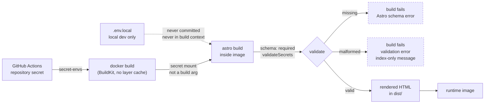

# feat: Add unlisted Ugift 529 contribution page

## Summary

Add a `/gift` page that renders each child's first name and Ugift code from a single build-time secret, alongside a walkthrough written for a non-technical relative. The gift data crosses from a GitHub Actions secret into the in-container Astro build via a BuildKit secret mount, so it reaches the rendered HTML without entering the repository, its history, its build metadata, or any shared build cache.

---

## Problem Frame

Every contribution to the children's 529 plans is currently gated on William being available to log into NJBEST and relay a code. See the origin document for the full problem framing.

The plan-specific complication is that this repository is public and its build runs inside the container image, so "put the codes on a page" is not a content change — it is a question of how a secret travels from GitHub into a static build without leaking on the way.

### What "unlisted" actually protects

Being precise about this matters, because two decisions below rest on it.

`src/pages/gift.astro` and its full copy are committed to a public repository. The **path `/gift`, the page's existence, and every word on it are therefore public** via GitHub code search, regardless of any no-index instruction. That is by construction and is not being fixed.

What is protected is narrower: **the pairing of a child's first name with their Ugift code**, and only from search indexing, git history, the container image, and the build cache. Anyone who guesses or discovers the URL and loads it sees everything. The controls in this plan raise the cost of *stumbling onto* the pairing; they do not make the URL secret.

---

## Requirements

- R1. One entry per child, identified by first name, with that child's Ugift code, rendered from supplied data rather than a fixed count.
- R2. A short walkthrough of how a contribution works: where to go, what to enter, payment methods, any minimum, and what the giver gets back.
- R3. A plain statement that the code permits contributions only.
- R4. A direct link to the Ugift site.
- R5. Typography, tone, and layout match the rest of the site.
- R6. The page lives at `/gift`.
- R7. Not linked from any other page, excluded from search indexing, absent from any sitemap.
- R8. Names and codes appear in the rendered page but never in the repository, its history, or any shared build cache.
- R9. A build without gift data fails loudly rather than publishing blank or placeholder codes.

**Origin actors:** A1 (account owner), A2 (giver — an older relative)
**Origin flows:** F1 (relative contributes via the shared page), F2 (account owner updates a code or adds a child)
**Origin acceptance examples:** AE1 (covers R9), AE2 (covers R7), AE3 (covers R8), AE4 (covers R1, R2, R3)

---

## Scope Boundaries

- No QR codes, printable cards, or Ugift deep links.
- No tax guidance of any kind.
- No password, passphrase, or login gate; no separate subdomain; the repository stays public.
- No backend, form, analytics, or client-side JS beyond what already exists.
- No thank-you, notification, or contribution-tracking flow.
- No restructuring of the existing landing or resume pages, and no shared navigation component.

### Deferred to Follow-Up Work

- Container registry visibility: if the GHCR package for this repository is publicly readable, the codes are retrievable from the published image. The fix (private package plus an image pull secret) belongs in the `homelab-kube-cluster` repository. **This is a real control, not a formality — check it before the first deploy.**
- Cloudflare tunnel routing already covers the site host, so no routing change is expected for a new path. Confirm when deploying.

---

## Context & Research

### Relevant Code and Patterns

- `src/layouts/Base.astro` — the shared layout; owns `<head>`, takes `title` and `description` props. The no-index and no-referrer instructions belong here.
- `src/pages/index.astro` and `src/pages/resume.astro` — both carry content as inline arrays in frontmatter, then map over them. Both pass an explicit `title` to `Base`.
- `src/pages/resume.astro` — closest structural precedent: standalone page, back-link to `/`, same `max-w-xl` container and neutral type scale.
- `Dockerfile` — `npm run build` runs in the `build` stage, so the gift data must cross the Docker boundary, not just the CI boundary.
- `.github/workflows/build-image.yml` — currently carries `cache-from: type=gha` and `cache-to: type=gha,mode=max`. Tags are `latest` plus `type=sha,format=long`.
- `.dockerignore` — verified to exclude `.env` and `.env.*`. Note this also excludes `.env.example` from the build context; harmless.
- `.gitignore` — verified to exclude only the literal names `.env` and `.env.production`. **`.env.local` is not covered** — U1 fixes this.
- No test framework, no test script, and no `docs/solutions/` directory exist today.

### Institutional Learnings

- None. `docs/solutions/` does not exist yet.

### External References

- Astro environment variables guide — a schema field declared as a server-side secret is validated on import; `env.validateSecrets` defaults to `false`, meaning secrets are otherwise validated only when something imports `astro:env/server`. The schema supports only string, number, boolean, and enum — no JSON or array. <https://docs.astro.build/en/guides/environment-variables/>
- GitHub Actions dependency caching — **verified verbatim**: "Don't store sensitive information in a cache. Anyone who can open a pull request against your repository can read the contents of caches in the base branch," and "forks of a repository can create pull requests on the base branch and access caches on the base branch." The documentation describes no visibility or privacy setting for Actions caches. <https://docs.github.com/en/actions/reference/workflows-and-actions/dependency-caching>
- Docker build-push-action secrets handling — the `secrets:` input is CSV-parsed and rejects an empty value; JSON and multi-line values require quoted/doubled-quote forms. The `secret-envs` input passes a fixed literal instead and sidesteps both problems.
- Astro 6.1.9 and Tailwind 4.2.4 confirmed from `package-lock.json`.

---

## Key Technical Decisions

- **No GitHub Actions layer cache on this build.** This is the single most consequential decision here. The workflow currently exports every intermediate layer with `cache-to: type=gha,mode=max` — including the build stage holding `/app/dist` with the rendered page. On a public repository, GitHub's own documentation states anyone who can open a pull request can read those caches, and there is no visibility setting to restrict them. That is a lower bar than pulling the image and, unlike GHCR visibility, it cannot be deferred elsewhere. `mode=min` does not help: the final image layers also carry `dist/`. Rejected alternative: a registry cache on a private GHCR package — more moving parts, and it re-couples cache safety to the same registry-visibility question. The build is `npm ci` plus a static build of three pages; paying it in full on every run is cheap.
- **A BuildKit secret mount, not a build argument.** Build arguments are recorded in image metadata and readable from image history. A secret mount is not persisted in a layer and is deliberately excluded from the layer cache key. The rendered HTML still carries the codes into the runtime image — the mount prevents an *additional* leak, it does not make the published image safe to share.
- **`secret-envs`, not `secrets`, on the build step.** The `secrets:` input is CSV-parsed: it rejects an empty value outright, and a JSON payload needs doubled-quote escaping that is easy to get wrong and impossible to debug because the value is redacted in logs. `secret-envs` passes a fixed literal name through instead, which tolerates an empty value at U1 and carries JSON unmangled.
- **`env.validateSecrets: true`.** Astro defaults this to `false`, which means a declared secret is validated only when something imports `astro:env/server`. Left at the default, U2 would declare the schema and verify nothing — the build would pass with the variable unset until U4 adds the page that imports it. Setting it true makes R9's missing-data half fire from U2, where the plan claims it does. If it proves not to fire for a static build with no adapter, the fallback is to rely on U4's import and move U2's build-behaviour verification there.
- **The validation module is a pure function over a raw string; the page does the import.** This is what keeps the module testable — a module that imported `astro:env/server` itself could not resolve that virtual module under Vitest.
- **Validation errors identify entries by array index only.** Never by name or code value. GitHub masks only the exact full secret string it was given, not substrings pulled out of it, and this repository's Actions logs are public. A single typo during a future update would otherwise print a child's name into a permanent public log.
- **One JSON-string variable rather than numbered per-child variables.** R1 requires no fixed child count; numbered variables would bake one in.
- **A no-index and no-archive meta instruction, and deliberately no `robots.txt` entry.** The original reasoning had two legs and one of them is now void: a `Disallow` line would *not* be what publishes the path, because the page source is already public in this repo. The surviving leg still holds and is sufficient — disallowing the crawl would stop crawlers from ever reading the no-index instruction, which is self-defeating. `noarchive` is added alongside because on-demand archival services ignore `noindex`.
- **A no-referrer instruction and `rel="noreferrer"` on the outbound link.** The page's primary call to action would otherwise hand the URL to the destination site and every analytics and tag vendor it loads, on first successful use.
- **Codes are set in monospace with generous letter-spacing.** The audience retypes these by hand on a phone into an unfamiliar financial form. A default sans-serif renders O/0 and I/1/l ambiguously, and a mistyped code is the most likely way this page fails at its actual job.
- **Vitest scoped to the validation module only, and wired into CI.** The repository has no test tooling. The validation logic is where R9's failure behaviour lives; the page is content. A suite that never runs automatically would be cost without benefit, so U2 also adds a `npm test` step to the workflow.
- **The data is a hard build requirement, not an optional input.** Making it optional and skipping the page when absent would be friendlier to a fresh clone, but converts a loud failure into a silent one: a deploy where the page simply is not there. The cost — a clone cannot build without a placeholder value — is paid once and documented.
- **Rejected: supplying the page from a cluster secret at deploy time.** Injecting the data in the cluster rather than the build would dissolve the Actions-cache leak, the GHCR exposure, the stale-cache problem and the tagging problem in one move, and would give the data a readable home. It loses on two grounds: it trades R9's loud build failure for a page that 404s or renders empty at runtime, and it pushes a data dependency into a site whose whole premise is being static. Recorded so the choice is on the record as considered, not path-dependent.
- **Plumbing lands before the requirement.** Making the variable required is what breaks a build that lacks it. Wiring Docker and CI first means no commit leaves `main` red.

---

## Open Questions

### Resolved During Planning

- **How does gift data reach the build?** A GitHub Actions secret, passed via `secret-envs`, mounted into the Docker build with BuildKit, read by Astro's env schema as a required server secret, parsed and validated by a pure module, consumed in page frontmatter at build time.
- **What does "fails loudly" mean, and should malformed data also fail?** Both fail. Missing data fails via Astro's schema validation with `validateSecrets: true`; malformed data fails via the validation module throwing during the static build. Note the split is not perfectly clean: `envField.string()` treats an empty string as *present*, so an empty secret passes the schema and is caught by the parse step instead. R9 still holds either way.
- **How to express no-index given the project configures neither sitemap nor robots.txt?** Optional props on the shared layout rendering no-index, no-archive, and no-referrer instructions. No `robots.txt` change.
- **Does a third page warrant shared navigation?** No. Navigation linking to `/gift` would violate R7 outright. The page stays standalone with a one-way back-link to `/`.
- **How does a data-only update actually reach production?** It does not, without a deliberate procedure — see Documentation / Operational Notes. Dropping the layer cache makes the rebuild produce fresh output; an empty commit to `main` is what produces a new SHA tag for Renovate to bump.

### Deferred to Implementation

- Exact walkthrough wording depends on two facts not yet confirmed: NJBEST's minimum Ugift contribution and its online payment method. Structure does not depend on them; copy does.
- Whether the walkthrough needs a distinct "paying by check" branch or one sentence, depending on what NJBEST offers.
- Whether an entry carrying unexpected extra keys should be ignored or rejected — the plan assumes ignored, so the data shape can grow.
- A real Ugift code's length and character set, which determines whether a format assertion is worth adding (see U2) and whether any character needs a disambiguation note on the page (see U4).

---

## High-Level Technical Design

> *This illustrates the intended approach and is directional guidance for review, not implementation specification. The implementing agent should treat it as context, not code to reproduce.*



The two dashed terminals are R9: there is no path from a bad input to a published page. The absent GHA cache node is deliberate — see Key Technical Decisions.

---

## Implementation Units

### U1. Plumb a build-time secret through Docker and CI

**Goal:** Carry gift data from a GitHub Actions secret into the in-container Astro build without recording it in image metadata or a shared cache. No application behaviour changes.

**Requirements:** R8

**Dependencies:** External prerequisite — the repository secret must exist in GitHub Actions settings **and hold a non-empty placeholder** (e.g. `[]`) before this unit's CI run. An empty value is rejected before Docker is invoked.

**Files:**
- Modify: `Dockerfile`
- Modify: `.github/workflows/build-image.yml`
- Modify: `.gitignore`
- Create: `.env.example`

**Approach:**
- The build stage runs `npm run build` inside the image, so the value must cross the Docker boundary rather than only the CI boundary.
- Mount the value as a BuildKit secret on the build step, exposed to the command as an environment variable. The `# syntax=docker/dockerfile:1` directive already present resolves to a frontend that supports this form. Mark the mount required so a build invoked without the secret fails at the Docker layer rather than relying solely on Astro.
- Pass the value with the build action's `secret-envs` input, not `secrets`. The `secrets` input is CSV-parsed: it rejects an empty value outright and mangles JSON without doubled-quote escaping. `secret-envs` avoids both.
- **Remove `cache-from` and `cache-to` from the build step.** See Key Technical Decisions — with a public repo this cache is world-readable and would hold the rendered page.
- Widen `.gitignore` from its two literal entries to a wildcard with an explicit exception for the example file. Vite's conventional filename for machine-local secrets is `.env.local`, which the current list does not cover.
- `.env.example` documents the expected variable and value shape, with obviously fake data, and states that the value must be single-line JSON.
- Leave tagging alone. The rotation problem it creates is solved procedurally, not by changing a scheme the homelab repo's Renovate config depends on.

**Patterns to follow:**
- The existing workflow step structure and its `docker/metadata-action` tagging — do not change tagging behaviour.

**Test scenarios:**
- Test expectation: none — build plumbing with no application behaviour. Correctness is observable only in build output, covered under Verification.

**Verification:**
- A CI build with a non-empty placeholder secret completes and pushes as before.
- The workflow run shows no cache export step, and no Actions cache entry is created for this workflow.
- Inspecting the built image's history shows no gift data and no new build argument.
- A local `npm run build` still succeeds at this point, because nothing consumes the variable yet — this unit is safe to land alone.
- `git check-ignore .env.local` reports it ignored.

---

### U2. Declare and validate the gift data

**Goal:** Make gift data a declared, required, shape-validated build input, so that neither absence nor malformation can produce a rendered page — and make the validation suite actually run in CI.

**Requirements:** R1, R8, R9. Realizes F2 (account owner updates a code or adds a child) — the validated list is what makes a data-only change sufficient; AE1 lands here.

**Dependencies:** U1, plus the repository secret populated with real data.

**Files:**
- Modify: `astro.config.mjs`
- Modify: `.github/workflows/build-image.yml`
- Create: `src/lib/gift.ts`
- Create: `src/lib/gift.test.ts`
- Create: `vitest.config.ts`
- Modify: `package.json`
- Modify: `README.md`

**Approach:**
- Declare the variable in the Astro config's env schema as a server-context secret, required, string-typed, and set `env.validateSecrets: true` so validation fires at build rather than only when something imports the server env module.
- Note that `.env` files are not loaded inside `astro.config.mjs`; the schema declares the variable, it does not read it.
- `src/lib/gift.ts` is a **pure function taking the raw string** — it does not import `astro:env/server` itself. The page performs that import and passes the value in. This is what keeps the module testable, since the virtual module does not resolve under Vitest.
- Validation rules: parses as JSON; is an array; is non-empty; every entry is an object with a non-empty first name and a non-empty code; no two entries share a code. Unknown extra keys are ignored.
- **Every thrown message identifies an offending entry by array index only** — never by its name or code value. This repository's Actions logs are public and GitHub masks only the exact full secret string, not substrings.
- Once a real code's format is known (see Open Questions), add a length and character-class assertion. Shape-only validation accepts a truncated or transposed code, which renders as a confident-looking wrong pairing and sends money to the wrong beneficiary — a worse silent failure than the empty list the plan already guards against.
- Add Vitest as a dev dependency with a `test` script and a `vitest.config.ts` using Astro's documented `getViteConfig()` helper. Add an `npm test` step to the workflow ahead of the Docker build, so a regression in validation fails CI rather than depending on someone running tests locally.
- Replace the Astro starter boilerplate in `README.md` with the real local-development story, including that gift data is now required to build and where the authoritative copy lives.

**Execution note:** Implement the validation module test-first. Its entire purpose is failure behaviour.

**Technical design:** *(directional guidance, not implementation specification)*

```
readGiftData(rawString) ->
    parse JSON            | on failure -> throw "not valid JSON"
    assert is array       | else       -> throw "expected a list of children"
    assert non-empty      | else       -> throw "no children configured"
    for each entry at index i:
        assert entry is an object          | else -> throw naming index i only
        assert name is a non-empty string  | else -> throw naming index i only
        assert code is a non-empty string  | else -> throw naming index i only
    assert no duplicate codes              | else -> throw naming the two indices
    return entries in input order
```

**Patterns to follow:**
- The frontmatter data-then-map shape used in `src/pages/resume.astro`, so the page consumes a plain ordered list.

**Test scenarios:**
- Happy path: a two-entry list parses to two children, preserving input order.
- Happy path: a one-entry list parses to exactly one child.
- Edge case: a three-entry list parses to three, confirming no fixed-count assumption. *(Covers AE4 in part.)*
- Edge case: an entry carrying an unknown extra key is accepted and the extra ignored.
- Edge case: names and codes containing whitespace or punctuation survive unmodified.
- Error path: a value that is not valid JSON throws, and the message says so. *(Covers AE1.)*
- Error path: an empty string throws as unparseable — the schema treats `""` as present, so this is the parse step's job, not the schema's.
- Error path: valid JSON that is not an array — an object, a bare string, a number — throws.
- Error path: an empty array throws; an empty page is a silent failure, not a valid state.
- Error path: an entry missing `code`, or with an empty-string code, throws.
- Error path: an entry missing `name`, or with an empty-string name, throws.
- Error path: an entry that is `null` or not an object throws rather than crashing later on an undefined field.
- Error path: two entries sharing the same code throw.
- **Security: for every error path above, the thrown message contains neither the entry's name nor its code value.** Assert this explicitly — it is the guard against leaking a child's name into a public CI log.

**Verification:**
- A build with the variable unset fails with Astro's missing-required-variable error. (If it does not, `validateSecrets` is not firing for a static build — fall back to the U4-import path and move this check to U4.)
- A build with a malformed value fails with the validation module's error, and the CI log shows no name or code.
- `npm test` passes and runs as part of the workflow, ahead of the image build.

---

### U3. Add no-index, no-archive, and no-referrer support to the shared layout

**Goal:** Let a single page opt into search-engine and referrer suppression, leaving every existing page's output unchanged.

**Requirements:** R7, R8

**Dependencies:** None — can land independently of U1 and U2. Note the prop is only *exercised* once U4 sets it; this unit proves the default is inert, U4 proves the prop works.

**Files:**
- Modify: `src/layouts/Base.astro`

**Approach:**
- Add an optional boolean prop defaulting to off. When set, the layout renders robots instructions (`noindex`, `noarchive`) and a no-referrer instruction in `<head>` alongside the existing description and icon tags.
- `noarchive` is included because on-demand archival services capture URLs regardless of `noindex`. The no-referrer instruction stops the page's own outbound link from handing the URL to third parties.
- Existing pages pass nothing and must render byte-identical output.
- Deliberately no `robots.txt` change — see Key Technical Decisions. No sitemap integration is installed, so there is nothing to exclude.

**Patterns to follow:**
- The existing `Props` interface and destructured-default pattern already used for `description` in `src/layouts/Base.astro`.

**Test scenarios:**
- Test expectation: none automated. A component-rendering harness for one boolean prop is disproportionate, and the prop has no consumer until U4. The checks below are manual, and the prop's positive case is proven by U4's verification.

**Verification:**
- Capture a baseline first: build and copy `dist/` to a scratch location **before** editing `Base.astro`. After the edit, rebuild and diff — the landing and resume pages must be byte-identical.
- The diff to `src/layouts/Base.astro` adds only the prop and the conditional tags.

---

### U4. Build the contribution page

**Goal:** Ship the page itself — the child list, the walkthrough, the reassurance, and the link out.

**Requirements:** R1, R2, R3, R4, R5, R6, R7. Realizes F1 (relative contributes via the shared page); AE2 and AE4 land here.

**Dependencies:** U2, U3

**Files:**
- Create: `src/pages/gift.astro`

**Approach:**
- Route at `/gift`, satisfying R6's say-it-aloud requirement. Rendered through the shared layout with the suppression prop set. The page imports `astro:env/server` and passes the raw value to the validation module.
- **Pass an explicit `title` and `description` that name no child** — for example a title naming only William. Both existing pages set an explicit title, and the default description would otherwise apply. This matters beyond convention: link-preview scrapers in messaging apps and email gateways fetch URLs server-side and ignore `noindex` entirely, and SMS and email are exactly how this link travels.
- Content order — **codes near the top**, because a phone-first reader who skims or suspects spam will bail before reaching them:
  1. Whose page this is, in one plain line, with a link back to `/` so a cautious relative can verify it is genuine.
  2. The child list with codes.
  3. What a Ugift code is, and the plain statement that it can only add money — no balance visibility, no withdrawals.
  4. The numbered walkthrough: where to go, what to enter, which payment methods, any minimum, and what arrives afterward (a confirmation page and email; the account owner sees the giver's name against the gift).
  5. The link out to Ugift, opening in a new tab with `rel="noopener noreferrer"` so the code stays on screen while the giver fills the form, and the URL is not passed to the destination or its vendors.
- **Set codes in monospace with generous letter-spacing**, marked up as code, each in its own visually distinct block rather than separated by whitespace alone. Once a real code's format is known, add a disambiguation note if any character is genuinely ambiguous.
- **Write the copy as plain fact, not reassurance.** State who is asking, what the code does and does not permit, and where to verify. Language like "completely safe" or "secure" is itself a scam tell to this audience and works against the trust the page is trying to build — let the verifiable back-link do the persuading.
- Write surrounding prose so it reads naturally at any child count; avoid hardcoded plurals.
- Leave the two unconfirmed copy facts — NJBEST's minimum and its online payment method — as explicit gaps. Do not publish until they are filled.
- Styling otherwise mirrors `src/pages/resume.astro`: same container width, same neutral type scale, same link treatment.

**Patterns to follow:**
- `src/pages/resume.astro` for the standalone-page shape, explicit title, back-link, and section rhythm.
- `src/pages/index.astro` for the frontmatter-array-then-map content pattern.

**Test scenarios:**
- Test expectation: none automated. Every meaningful check here requires a full build against a specific gift dataset, and standing up a dist-asserting harness would need real gift data in the test environment — a secret-handling problem worse than the one it verifies. The data-driven logic is covered by U2's suite; the checks below are manual and run once before publishing.

**Verification:**
- Build with a two-entry dataset: two entries render, each pairing a first name with its own code. Repeat with one entry and with three — no fixed-count assumption survived into the template. *(Covers AE4 in part.)*
- The built page carries `noindex`, `noarchive`, and the no-referrer instruction; no other built page does. *(Covers AE2.)*
- The built page's `<title>` names no child.
- The built page contains no empty or placeholder code slots.
- No other built page links to `/gift`. *(Covers AE2.)*
- Searching the working tree and the full repository history surfaces no code and no child's first name. *(Covers AE3.)*
- `/gift` is reachable in local preview and readable at roughly 400px wide without horizontal scrolling; the codes are legible and selectable at that width.
- A reader who has never heard of Ugift can state, after reading the page, what a code does, what it cannot do, and what their next action is.

---

## System-Wide Impact

- **Interaction graph:** `src/layouts/Base.astro` is shared by every page. The new props are additive and default off, so the landing and resume pages must be unaffected — U3 requires a before/after `dist/` diff to prove it.
- **Error propagation:** Validation failures are intended to be fatal at build time and must not be caught or defaulted anywhere. A build that "recovers" from bad gift data violates R9. Error text must never carry entry data, because it lands in public CI logs.
- **State lifecycle risks:** None at runtime — the output is static. The risk is at deploy time and is mechanical, not just human: without the fixes in this plan, a rebuild after a code change would reuse cached layers and produce identical output, and would emit the same image tag, so nothing would roll out. Both are addressed — the cache is removed, and the tagging step of the update procedure is written down.
- **API surface parity:** None.
- **Integration coverage:** The seam unit tests cannot prove is secret → Docker → Astro → HTML. Only an actual build proves it, which is why U1, U2 and U4 all carry build-behaviour verification.
- **Unchanged invariants:** Existing routes, the Dockerfile's runtime stage, image tagging, and the deployed service surface are unchanged. Build caching is deliberately changed. The only cross-cutting code edit is the additive layout props.

---

## Risks & Dependencies

| Risk | Mitigation |
|------|------------|
| GitHub Actions cache exposes the rendered page to anyone who can open a PR on this public repo | U1 removes `cache-from`/`cache-to` from this build. Do not re-add them; the rationale is recorded in Key Technical Decisions. Purge any existing caches for this workflow after the change |
| The published image is publicly pullable, making the codes readable regardless of build hygiene | Deferred to the homelab repository by design, but it is the actual control on image exposure. Check GHCR package visibility before the first deploy |
| A code is updated and the rebuild silently ships stale data | Removing the layer cache means every build genuinely rebuilds. The full procedure is in Documentation / Operational Notes |
| A code is updated, the rebuild succeeds, and nothing deploys because the image tag did not change | The update procedure requires an empty commit to `main` so a new SHA tag is produced for Renovate to bump |
| Validation error text leaks a child's name into public CI logs | Errors reference array indices only; U2 carries an explicit test asserting no entry data appears in any thrown message |
| A truncated or transposed code renders as a confident wrong pairing | Duplicate-code check now; format assertion once a real code's shape is known; post-deploy confirmation of rendered pairings against NJBEST |
| The secret is committed by accident during local development | `.dockerignore` already wildcards `.env.*`; U1 widens `.gitignore` to match, since `.env.local` is not currently covered. `.env.example` carries only obviously fake data |
| The only readable copy of the gift data is on one laptop | An authoritative copy lives in a password manager — see Documentation / Operational Notes. GitHub secrets are write-only and cannot be read back |
| R3's contributions-only assurance is wrong | It is currently verified only against a generic multi-plan FAQ. A Before-Publishing gate requires confirming it against the real NJBEST flow |
| Making the variable required breaks `npm run build` for a fresh clone | Accepted and documented. `.env.example` plus the README make a placeholder a one-line fix |
| A `robots.txt` `Disallow` line gets added later by reflex, suppressing the no-index instruction | Recorded as an explicit decision with rationale here and in Documentation / Operational Notes |
| A sitemap integration is added later and silently includes the page | Recorded under Documentation / Operational Notes as a filter requirement |

---

## Documentation / Operational Notes

### Where the gift data actually lives

GitHub Actions secrets are write-only — once set, the value cannot be read back. Without a durable readable copy, adding a third child would mean retyping every existing child's code, which would require a fresh NJBEST login: the exact chore this page exists to eliminate.

**The authoritative copy is a password manager entry.** The GitHub Actions secret and any local `.env.local` are both derived from it. Record this in the README.

### Updating a code or adding a child (flow F2)

1. Update the authoritative copy in the password manager.
2. Update the `GIFT_DATA` repository secret in GitHub Actions settings.
3. Push an empty commit to `main`. This is what produces a new SHA tag — a `workflow_dispatch` run on an unchanged commit re-emits the tag it emitted last time, and Renovate would see no bump.
4. Confirm the workflow ran with no cache restore and pushed a new tag.
5. Confirm Renovate opened the image-bump PR in `homelab-kube-cluster`, and that it merged.
6. Load `/gift` and confirm the rendered pairings match NJBEST.

Steps 3 and 6 are the ones most likely to be skipped and the ones that make the difference between an update that deploys correctly and one that silently does nothing.

### Before publishing

- Confirm R3 against the **real NJBEST flow**, not the generic Ugift FAQ: enter one real code as an outsider and record what the giver is actually shown. If a code holder sees more than expected, R3's wording is wrong and the origin's unlisted-rather-than-gated decision needs reopening.
- Confirm NJBEST's minimum Ugift contribution and its online payment method (the two open copy facts).
- Confirm the GHCR package visibility for this repository.
- Purge existing Actions caches for this workflow.

### Standing notes

- `README.md` currently contains unmodified Astro starter boilerplate. U2 replaces it.
- Record in the README: **if a sitemap integration is ever added, `/gift` must be excluded from it**; **`/gift` must never be added to a `robots.txt` `Disallow` list**; and **build caching must not be re-enabled for this workflow**.
- No Cloudflare tunnel or DNS change is expected — the tunnel terminates the site host and this is a new path on an existing host. Confirm at deploy time.

---

## Sources & References

- **Origin document:** `docs/brainstorms/ugift-529-contribution-page-requirements.md`
- Related code: `src/layouts/Base.astro`, `src/pages/resume.astro`, `Dockerfile`, `.github/workflows/build-image.yml`
- External docs: Astro environment variables — <https://docs.astro.build/en/guides/environment-variables/>
- External docs: GitHub Actions dependency caching — <https://docs.github.com/en/actions/reference/workflows-and-actions/dependency-caching>
- External docs: Ugift FAQ — <https://www.ugift529.com/home/faqs.html>
